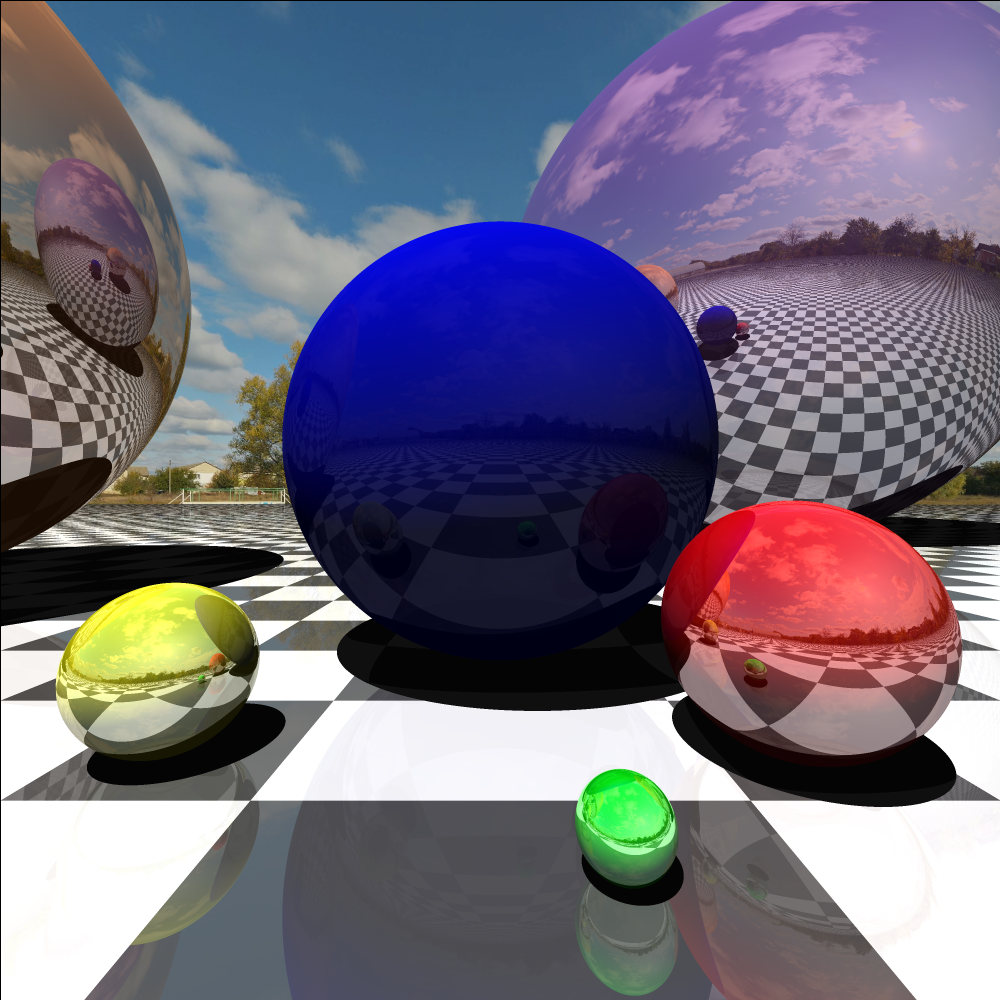
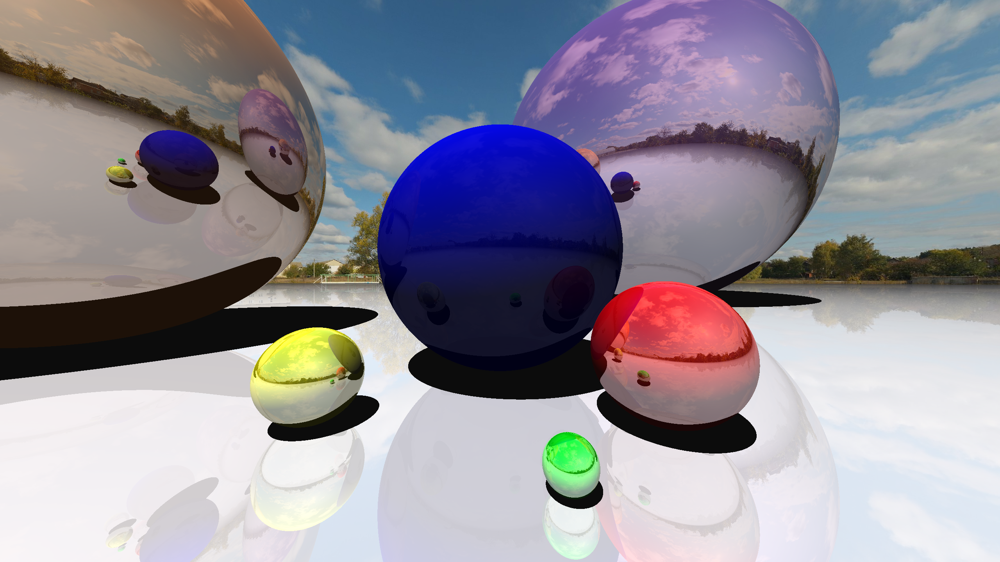

# Python-Ray-Tracing
Ray tracing program created in python, no external libraries only pygame to display the output pixels and math to do certain operations

This Ray Tracer can do the following:
 - Spheres and planes (More complex shapes to come)
 - Diffuse shading and object shading
 - SSAA (Super Sampling Anti Aliasing)

---

without SSAA

with SSAA

Most noticeable on the reflections of the floor in the spheres

---

## Resolutions
# 2K (6 minute rendering time) (scene was rendered without checkered floor)

# 4K (<20 minute rendering time)

# 8K (<1 hour rendering time

